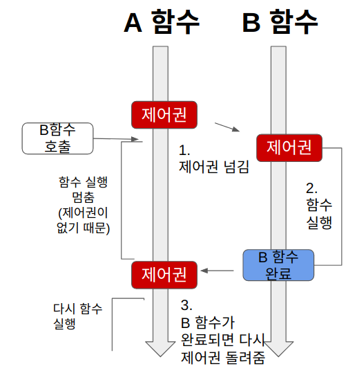
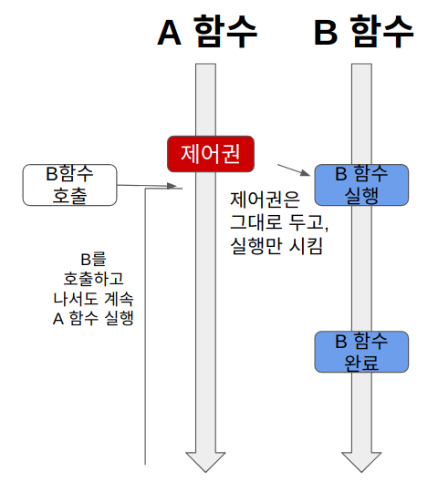
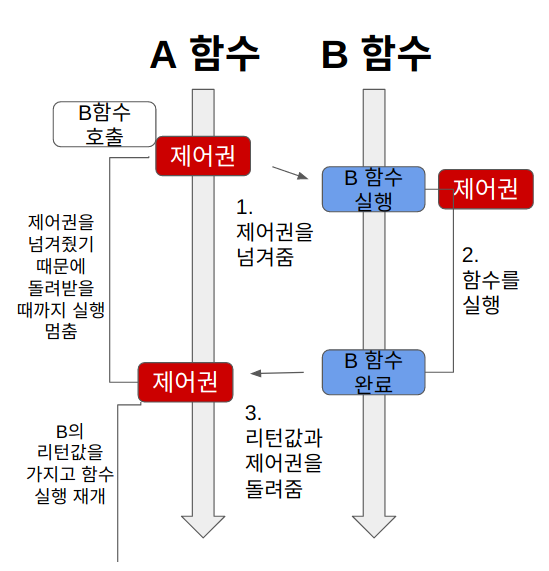
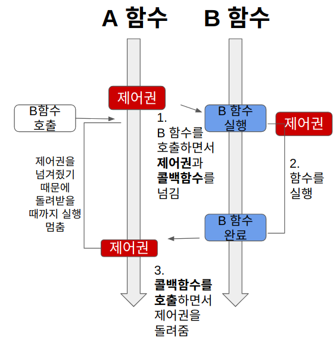
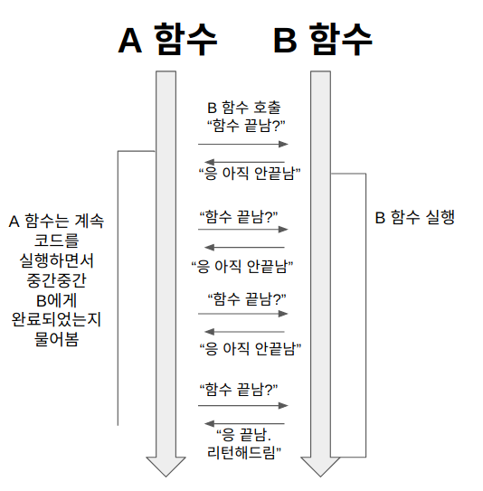
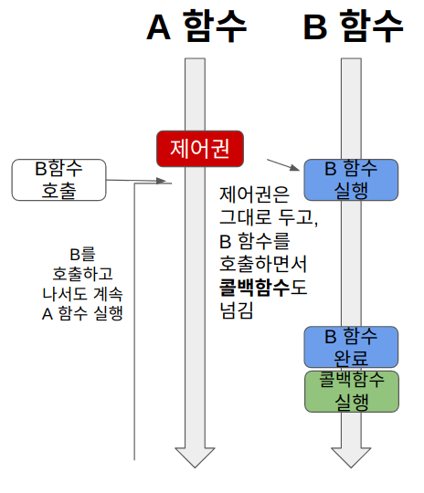

## 글의 작성 이유...

논블로킹, 블로킹, 비동기, 동기 그리고 스레드와의 관계에 대해 햇갈리고 깊게 공부해 본 적이 없었다...

그래서 이들의 차이점에 대해 공부를 해보고자 글을 작성하게 되었다.

면접에서도 자주 나오는 CS 이니 꼭 알면 좋을 듯 하다

## 블로킹

블로킹(Blocking) : 영어 단어 그대로 무언가를 막는다라는 의미이다.

즉 A함수가 실행 도중 B 함수를 호출 시 제어권이 B함수에게 간다라고 생각을 하면 된다.

*https://velog.io/@nittre/%EB%B8%94%EB%A1%9C%ED%82%B9-Vs.-%EB%85%BC%EB%B8%94%EB%A1%9C%ED%82%B9-%EB%8F%99%EA%B8%B0-Vs.-%EB%B9%84%EB%8F%99%EA%B8%B0*

이렇기에 A는 B가 실행 중인 동안에는 멈춰(블로킹) 되어 있는 상태가 된다.

## 논블로킹

당연히 논블로킹은 블로킹의 반대라 생각하면 된다.

즉 제어권을 주지 않는다! 라고 생가하면 된다.

*https://velog.io/@nittre/%EB%B8%94%EB%A1%9C%ED%82%B9-Vs.-%EB%85%BC%EB%B8%94%EB%A1%9C%ED%82%B9-%EB%8F%99%EA%B8%B0-Vs.-%EB%B9%84%EB%8F%99%EA%B8%B0*

그렇기에 A또한 계속해서 실행하게 되는 것이다.

## 동기

그럼 동기는 무엇인가?

동기와 비동기는 다른 함수가 실행을 완료하였는지 안했는지를 확인하는 것이다.

동기는 함수 A가 B 함수 호출 후 결과를 계속 확인하면서 신경 쓰는 것이다.

## 비동기

반대로 비동기는

함수 A가 함수 B를 호출할 때 **콜백 함수를 함께 전달**해서, 함수 B의 작업이 완료되면 함께 보낸 콜백 함수를 실행한다.

그래서 함수 A는 함수 B를 호출한 후로 **함수 B의 작업 완료 여부에는 신경쓰지 않는다.**

그럼 논블로킹과 비동기의 차이는 무엇인가?

일단 논블로킹은 작업의 흐름 단위로 봐야할 듯 하다. 현재 작업을 block할거냐 말거냐라는 의미이고

반대로 비동기는 저 함수의 리턴값이 나랑은 상관이 없다. 순차적으로 할거냐 말거냐라는 의미인듯 하고

즉 관점이 다르다고 생각 할 수 있다.

## 종류

### 동기 & 블로킹

동기와 블로킹 방식은 이해하기가 쉽다.

*https://velog.io/@nittre/%EB%B8%94%EB%A1%9C%ED%82%B9-Vs.-%EB%85%BC%EB%B8%94%EB%A1%9C%ED%82%B9-%EB%8F%99%EA%B8%B0-Vs.-%EB%B9%84%EB%8F%99%EA%B8%B0*

### 비동기 & 블로킹

사실 비동기와 블로킹을 쓰는 경우는 없다라고 본다. (본적도 없다.)

비동기이기에 상대방의 결과값에 관심이 없는데, 제어권은 줘야한다...?

차피 제어권을 주니 동기 & 블로킹과의 성능적 차이가 없다.

*https://velog.io/@nittre/%EB%B8%94%EB%A1%9C%ED%82%B9-Vs.-%EB%85%BC%EB%B8%94%EB%A1%9C%ED%82%B9-%EB%8F%99%EA%B8%B0-Vs.-%EB%B9%84%EB%8F%99%EA%B8%B0*

### 동기 & 논블로킹

*https://velog.io/@nittre/%EB%B8%94%EB%A1%9C%ED%82%B9-Vs.-%EB%85%BC%EB%B8%94%EB%A1%9C%ED%82%B9-%EB%8F%99%EA%B8%B0-Vs.-%EB%B9%84%EB%8F%99%EA%B8%B0*

동기와 논블로킹을 쓰는 경우에는 상대방의 결과값에는 관심이 있으나 흐름이 멈추면 안된다.

그렇기에 계속해서 물어보게 되는 것이다.

그렇기에 A는 A대로 계속 코드를 수행하고 결과값이 리턴되면 그땐 받아오는 것이다.

### 비동기 & 논블로킹

Node.js를 쓴다면 가장 먼저 배우는 개념이 아닐까 한다.

*https://velog.io/@nittre/%EB%B8%94%EB%A1%9C%ED%82%B9-Vs.-%EB%85%BC%EB%B8%94%EB%A1%9C%ED%82%B9-%EB%8F%99%EA%B8%B0-Vs.-%EB%B9%84%EB%8F%99%EA%B8%B0*

A 함수는 제어권을 주지 않고, 콜백함수를 넘겨줘서 결과값을 기다리지 않고 A는 A대로 실행하고 B가 완료되면 콜백함수를 실행해 받아오게 된다.

## 스레드와 비동기 & 동기의 관계성

그럼 여기서 함정이 비동기를 자세히 보면 멀티 스레드와의 관계는 어떻게 되는지 궁금증이 생긴다.

비동기도 동시성을 주기 위해 사용하는 것이고, 멀티 스레드도 그렇지 않나...? 싶어 찾아보았다.

**일단 멀티 스레드와 비동기는 서로 다르다!!**

그럼 왜 다른가?

일단 **스레드는 공간을 나타내고, 동기/비동기는 순서를 나타낸다**

대표적인 예시로 싱글 스레드에서도 비동기 & 동기 작업이 둘다 가능하다....

당연히 멀티 스레드에서도 비동기 & 동기 작업이 수행된다.

#### 싱글 스레드 - 동기

일단 싱글 스레드, 동기를 살펴보자

그럼 하나의 공간에서 순서대로 작업을 처리한다라는 의미이다.

Thread\_1 : |< — — A — →||< — — B — →||< — — C — →|

그래서 이런식으로 순서대로 실행을 할 것이다.

#### 싱글 스레드 - 비동기

싱글 스레드에서도 비동기가 가능하다.

이런 경우에는 A,B,C가 순서대로 흘러가지 않는다는것이 중요하다

Thread\_1 : |< — — A |< — — B — |< — — C — | — A — | — C | — B — | B — → | C — → | — A — → |

하지만 이런 경우는 솔직히... 큰 의미가 있을 까 싶다 ㅎㅎ

#### 멀티 스레드 - 동기

멀티스레드가 동기라는 이야기는

여러 공간에서 순서대로 작업한다라는 이야기인데...

Thread\_1 : |< — — A — →|

Thread\_2 : — — — — — — →|< — — B — →|

Thread\_3 : — — — — — — — — — — — — — — →|< — — C — →|

그러면 이러헥 된다고 한다

약간 더긴 이유는? => 스레드 생성에도 비용이 든다 ㅎㅎ...

#### 멀티 스레드 - 비동기

우리가 일반적으로 멀티 스레드를 사용하는 이유로는 여러 작업을 동시에 돌려 더 빠르게 처리 하고자 하는 것이 목표인 것이다.

그렇기에 멀티스레드 & 비동기는 이렇게 처리가 된다.

Thread\_1 : |< — — A — →|

Thread\_2 : — — →|< — — B — →|

Thread\_3 : — — — — →|< — — C — →|

## 후기..

참 어렵고 햇갈리는 주제인 듯 하다..

솔직히 맞게 적었는지도 햇갈리기는 하다...(많은 자료로 공부를 했는데..)

혹시라도 제가 잘 못 적은 부분이 있다면 언제든지 지적을 해주시면 감사합니다 ㅎㅎ..

## 참고사이트

<https://velog.io/@nittre/%EB%B8%94%EB%A1%9C%ED%82%B9-Vs.-%EB%85%BC%EB%B8%94%EB%A1%9C%ED%82%B9-%EB%8F%99%EA%B8%B0-Vs.-%EB%B9%84%EB%8F%99%EA%B8%B0>

블로킹 Vs. 논블로킹, 동기 Vs. 비동기

와 드디어 이해했다 속이 후련~

velog.io
