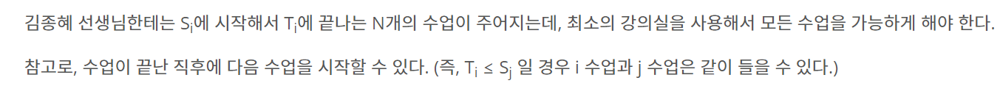

<https://www.acmicpc.net/problem/11000>

11000번: 강의실 배정

첫 번째 줄에 N이 주어진다. (1 ≤ N ≤ 200,000) 이후 N개의 줄에 Si, Ti가 주어진다. (0 ≤ Si < Ti ≤ 109)

www.acmicpc.net

## 주저리 주저리

생각보다 까다로운 문제였다.

이런 유형의 문제는 어디선가 많이 본 듯 해 필수적으로 풀어두면 좋을 것 같다

딱봐도 정렬이 필요함을 느꼈는데, 더 문제는 정렬만 쓰면 TO가 떠버리는 것이 큰 함정이다.

아 우선순위 큐를 이용해서 시간을 줄이는데 나는 여기서 heapq를 이용하여 작업을 진행하였다. => 하나 배워간다

### 문제 해결



자 일단 그리디 적으로 생각을 하는 것이 1순위라 생각이 된다.

생각을 해보면 한 강의실에서 최대한 많은 개수의 수업을 넣는 것이 중요하다 생각된다.

그럼 S가 최대한 작고 T도 작으면 좋다는 것은 여기서 당연히 유추가 될 수 있다. (T가 작아야 그 다음 올 수 있는 수업의 경우의 수가 커지니)

그래서 일단 수업을 받고, 이것들을 싹 다 정렬해준다. => 여기까지가 첫 작업이라 생각하자

그 다음엔 우린 시작하는 시간과 끝시간을 비교를 해야한다.

A의 끝 시간이 B의 시작 시간보다 같거나 작은 경우 or 역으로 큰 경우 이렇게 나누어 생각을 해 비교를 해야한다.

이때 heap을 사용한다.

heap을 사용시 자동으로 정렬이 되 들어가므로 매번 우리가 정렬을 하지 않아도 된다. (시간 복잡도 개선)

자 그럼 heap에다가 맨 처음 시간의 끝 시간을 넣어보자.

끝시간을 넣고, 반복문을 돌려 heap의 맨 처음 값과 시작시간들을 비교한다.

만약 시작시간이 더 작다면 얘도 heap에 추가를 해준다 => 새 강의실을 만들어야 하니..

그렇게 만약에 더 크거나 같으면 heap에서 pop을 해 제거해주고 해당하는 끝 값을 넣어줍니다.

이런식으로 반복을 하게 되면, 답이 나온다

왜 그럴까? => 그리디 식으로 접근해보자. 당연하게도 예를 들어 1 3, 2 4, 3 5 라는 예시가 있다 가정하자.

정렬을 하면 저렇게 나올 것이고, 처음값의 끝 값인 3이랑 그 다음 값의 시작값은 2랑 비교를 하면 그 다음 시작값이 더 작기에 새 강의실을 만들어야만 한다.

우리가 정렬을 앞 값, 뒤 값 기준으로 하였기에 이게 가능한 접근이라 생각하면 된다.

#### 코드

```python
import sys
import heapq
input = sys.stdin.readline
n = int(input())
q = []
for i in range(n):
    start, end = map(int, input().split())
    q.append([start,end])
q.sort()
hq = []
heapq.heappush(hq,q[0][1])
for i in range(1,n):
    if q[i][0] < hq[0]:
         heapq.heappush(hq,q[i][1])
    else:
        heapq.heappop(hq)
        heapq.heappush(hq,q[i][1])
    
print(len(hq))
```
