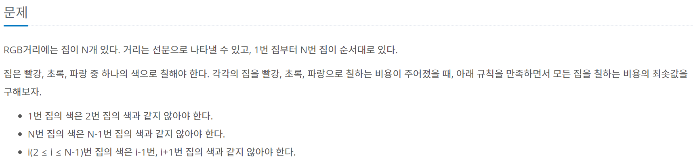

<https://www.acmicpc.net/problem/1149>

1149번: RGB거리

첫째 줄에 집의 수 N(2 ≤ N ≤ 1,000)이 주어진다. 둘째 줄부터 N개의 줄에는 각 집을 빨강, 초록, 파랑으로 칠하는 비용이 1번 집부터 한 줄에 하나씩 주어진다. 집을 칠하는 비용은 1,000보다 작거나

www.acmicpc.net



## 주저리 주저리

문제를 읽자마자 이게 어떻게 풀어야 할까 순간 고민을 했다.

하지만 시간이 0.5초이고... 그러면 적어도 브루트 포스나 백트래킹은 아닐거라 판단하였다.

하지만 탐색하면서 찾아야 하는 거기에 그럼 DP를 도입하기로 결정하였다.

문제는 간단하다 이웃하는 집과는 색이 달라야한다 끝!

다행이 첫 집과 끝 집이 연결되어 있는 원형모양이 아닌 직선모양인것이 쉬운 점이라 판단한다.

### 문제 해결

조금 고민을 했었는데, 생각보다 간단하게 풀렸다.

일단 시작을 첫 집부터 시작해 dp에 3가지 케이스를 다 넣었다.

그 다음 부터 다음집은 이전 dp랑 비교해가면서 그 색과 다른 rgb 값 중 제일 작은 애의 값과 더해가면서 계산을 진행 하였다.

```python
import sys
input = sys.stdin.readline
n = int(input())
house = []
dp = [[0 for _ in range(3)] for _ in range(n+1)]
for _ in range(n):
    house.append(list(map(int, input().split())))
for i in range(len(house)):
    dp[i+1][0] = house[i][0] + min(dp[i][1], dp[i][2])
    dp[i+1][1] = house[i][1] + min(dp[i][0], dp[i][2])
    dp[i+1][2] = house[i][2] + min(dp[i][0], dp[i][1])
print(min(dp[n]))
```

생각보다 간단하게 풀려서 놀라운 문제였다.
