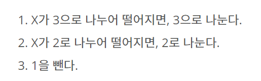

<https://www.acmicpc.net/problem/1463>

1463번: 1로 만들기

첫째 줄에 1보다 크거나 같고, 106보다 작거나 같은 정수 N이 주어진다.

www.acmicpc.net

## 주저리 주저리

개인적으로 이런 유형의 문제는 DP를 한다면 한번쯤은 풀어보면 좋을 것 같다는 느낌이 든다.

이런 유형의 문제는 어디서든 간단한 문제로 볼 수 있기 때문이라 생각한다.

### 문제 해결



위 조건들을 이용해 1을 만드는 최소의 횟수를 구하는 문제이다.

아주 간단하다 각 조건에 맞게 dp를 넣으면 된다

예를들어 2는 2로 나누어 떨어지니 dp[2//2] + 1로서 1이 되니 정답이 된다.

여기서 중요한 것은 dp값을 아주 크게 주는 것이다. (최소 값을 구하는 것이니)

이런식으로 문제에 적용 시키면 된다.

#### 코드

```python
import sys
input = sys.stdin.readline
n = int(input())
dp = [999999999999999]*1000001
dp[0] = 0
dp[1] = 0
for i in range(2,n+1):
    if i%2==0:
        dp[i] = min(dp[i//2]+1,dp[i])
    if i%3==0:
        dp[i] = min(dp[i//3]+1,dp[i])
    dp[i] = min(dp[i],dp[i-1]+1)
print(dp[n])
```
