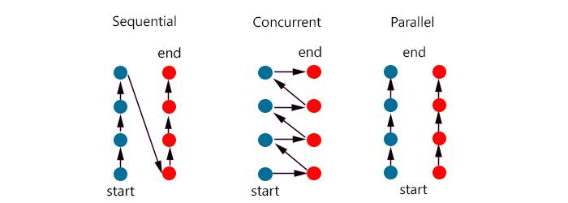
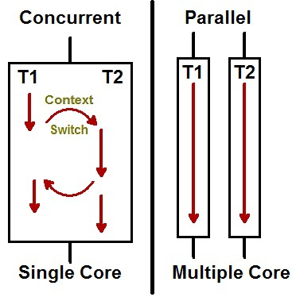
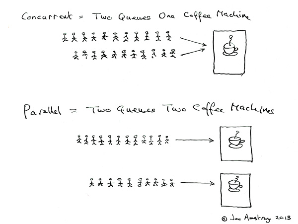

Node.js를 배우다보면 동시성이라는 말을 자주 듣게 된다.\
그런데 가끔씩 동시성과 병렬성이라는 단어 자체를 비슷하게 사용하는 글들도 있는데, 엄연히 다른 것이므로 분리해서 봐보자

## 동시성(Concurrency) vs 병렬성(Parallelism)

**간단하게 동시성은 논리적으로 동시에 작업하는 것이고, 병렬성은 물리적으로 동시에 실행되는 것이다**

출처 <https://seamless.tistory.com/42>

자 그림을 봐보자

Concurrent같은 경우 Sequential과 다르게 왔다리 갔다리 하는 것을 확인 할 수 있다.

반면 Parallel은 두개가 각각 화살표가 진행되는 것을 확인 가능하다.

출처 <https://seamless.tistory.com/42>

이 그림을 봐보자.

싱글 코어의 멀티 스레드는 실제로는 번갈아 가면서 도는 것을 확인 할 수 있다. ( 왜냐 코어에서 연산 작업을 해야하는데, 코어가 하나밖에 없기 때문에!)

더 자세한 내용은 CPU와 Core 관련 공부를 하자

그래서 눈속임으로 아 저 작업이 동시에 돌아가는 구나로 착각 가능하다.

출처 <https://seamless.tistory.com/42>

이 그림이 아주 좋은 설명이었다.

한 커피집에 2줄로 서면서 순서대로 커피를 받아가면 아 **동시에** 받는 구나라고 생각 가능하다

반면 밑처럼 커피 가게가 두개라면?

진짜로 각 줄 마다 받게 된다.

따라서 실행 시간을 줄이는 대에 단순히 멀티 스레드가 답입니다! 라고 하면 틀린 것이다.

‘멀티 코어’에서 멀티 스레드로 실행 시에 실행 시간이 줄어 드는 것이다.(병렬 처리에만)

- 그런데 요즘 대부분이 싱글 코어는 없다…

## 참고 사이트

<https://seamless.tistory.com/42>
