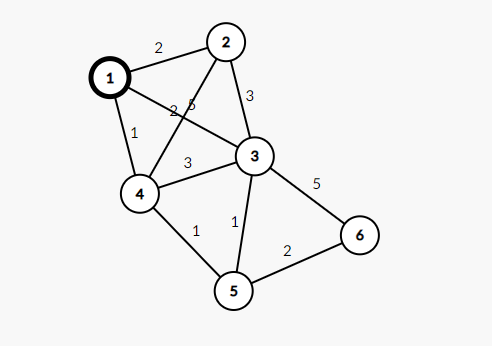

## 소개

다익스트라는 최단경로 알고리즘 중에서도 대표적인 예시라고 할 수 있다.

하나의 시작 정점에서부터 모든 다른 정점까지의 최단 경로를 구하는 알고리즘이다. (다만 weight값이 음수이지만 않는다면)

## 배경

최단 경로 알고리즘은 graph 자료구조를 사용하며, node와 edge를 이용해 실제 거리를 나타낸다.

> 1. 출발 노드, 도착 노드 설정\
> 2. edge에 값을 부여\
> 3. 출발 노드부터 시작해 방문하지 않은 인접 노드 방문, 거리를 계산하고, 현재거리와 비교해 더 작은 값을 넣는다.\
> 4. 방문하지 않은 노드 중 가장 비용이 적은 노드 선택\
> 5. 해당 노드를 거쳐 특정 노드로 가는 경우를 고려해 최소 비용 갱신\
> 6. 4~5를 반복

ex)



이런 그래프가 있다 가정하자

자 그럼 표를 만들어서 보자

| 0 | 2 | 5 | 1 | inf | inf |
| --- | --- | --- | --- | --- | --- |
| 2 | 0 | 3 | 2 | inf | inf |
| 5 | 3 | 0 | 3 | 1 | 5 |
| 1 | 2 | 3 | 0 | 1 | inf |
| inf | inf | 5 | 1 | 0 | 2 |
| inf | inf | 5 | inf | 2 | 0 |

가로 세로가 각 노드를 의미한다.

자기 자신은 0이다. (자기 자신에게 돌아오는 간선이 없으니)

또한 아직 바로 연결되지 않은 곳은 inf로 표시를 한다.(무한하다는 의미)

1번 노드를 보면 당장의 최소 비용은

| 0 | 2 | 5 | 1 | inf | inf |
| --- | --- | --- | --- | --- | --- |

이것이 된다

그럼 우리는 1번노드를 방문했다 하고, 4번 노드로 간다.(최소비용 1이니)

자 그럼 4번노드를 선택하고 보자

선택을 하면 이제 갱신이 시작된다

원래 1 -> 3을 가는 비용은 위에서 보다 싶이 5다

그러나 1->4->3을 간다면 비용은 4가 된다

즉 더 작은 값으로 갱신을 해준다.

또한 원래 1->5는 INF였으나

이젠 4->5라는 경로가 생겼다. 그래서 1->4->5라고 가정해 2라고 쓸 수 있게 된다

| 0 | 2 | 4 | 1 | 2 | inf |
| --- | --- | --- | --- | --- | --- |

이런식을 계속해서 모든 노드를 다 방문할때 까지 진행한다

이런 방식으로 진행하는 것이 dijkstra이다.

<https://m.blog.naver.com/ndb796/221234424646>

23. 다익스트라(Dijkstra) 알고리즘

다익스트라(Dijkstra) 알고리즘은 다이나믹 프로그래밍을 활용한 대표적인 최단 경로(Shortest P...

m.blog.naver.com

과정을 자세히 보고 싶으면 위 블로그를 참조하는 것이 좋다 생각한다.

자 그럼 코드로 작성해보자

## 코드

```sql
import heapq  # 우선순위 큐 구현을 위함

distances = {node: float('inf') for node in graph}  # start로 부터의 거리 값을 저장하기 위함
def dijkstra(graph, start):
  queue = []
  heapq.heappush(queue, [distances[start], start]) 
  while queue:  
    distance, node = heapq.heappop(queue)  # 탐색 할 노드, 거리를 가져옴.

    if distances[node] < distance:  # 기존에 있는 거리보다 길다면, 볼 필요도 없음
      continue
    
    for new_node, new_distance in graph[node].items():
      new_distance = distance + new_distance  # 해당 노드를 거쳐 갈 때 거리
      if new_distance < distances[new_node]:  # 알고 있는 거리 보다 작으면 갱신
        distances[new_node] = new_distance
        heapq.heappush(queue, [new_distance, new_node])  
 
  
  distances[1] = 0  # 시작 값은 0이어야 함
  graph = {
  	'1': {'2':3}
    '2': {'1':3}
  }
  dijsktra(graph, 1)
```

```sql
def dijkstra(graph,start):
    queue = []
    dp = [inf for _ in range(n+1)]
    heapq.heappush(queue,[0,start])
    dp[start] = 0
    while queue:
        distance, current = heapq.heappop(queue)
        if dp[current] < distance:
            continue
        for new_current,new_distance in graph[current]:
            new_distance += distance
            if dp[new_current] > new_distance:
                dp[new_current] = new_distance
                heapq.heappush(queue, [new_distance,new_current])

graph = [[] for i in range(n+1)]
```
