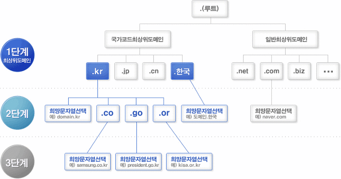
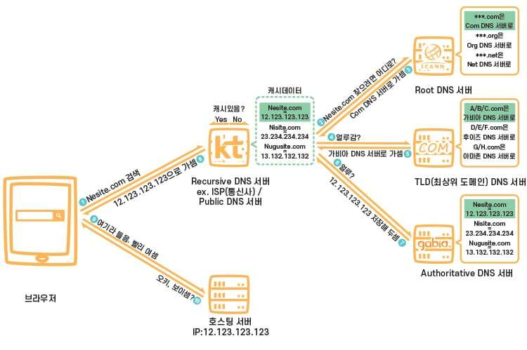

## DNS란

Domain Name Space의 약자이다.

우리는 네트워크 상에서 Host를 식별하기 위해 **IP**주소를 사용한다.

하지만 일반적으로 우리는 도메인 이름으로 사이트에 접속하는 경우가 대부분인데, 이 또한 최종적으로는 IP 주소랑 매핑이 되어야만 한다.

그래서 이 도메인 이름을 IP주소로 해석을 해주는 DNS가 나오게 되었다.

DNS는 보통 패킷의 사이즈가 매우 작아 loss 발생이 적기에 **UDP**로 빠르게 보낸다고 한다. ( loss 되어도 단순 접속을 위한 시도이니 다시 시도하면 된다. )

다만 큰 패킷을 보내거나 Zone Transfer 시에는 신뢰성 있는 전송이 필요해 **TCP**로 전송한다고 한다. (이에 대해서는 나중에 공부해 보겠다.)

### 역할

1) 호스트에게 별칭을 줄 수 있다.

ex) relay1.naver.com 이라 한다면 호스트는 naver.com과 www.naver.com 같은 별칭을 2개 쓸 수 있다.

2) 메일 서버 별칭

3) 부하 분산

같은 도메인이더라도 다른 ip를 제공함으로서 부하를 분산 시킬 수 있다.

## 계층 구조

*https://velog.io/@ckstn0777/%EB%84%A4%ED%8A%B8%EC%9B%8C%ED%81%AC-%EC%95%A0%ED%94%8C%EB%A6%AC%EC%BC%80%EC%9D%B4%EC%85%98-%EA%B3%84%EC%B8%B5-DNS*

위의 그림에서 보다 싶이 앞에서 부터 레벨이 높아지는 것이 아닌 **뒤에서 부터 체크하는 것이다.**

*https://galid1.tistory.com/53*

1. 그래서 처음에는 .을 보고 Root DNS 서버에 접속하고, 거기서 .com을 가지고 있는 TOP-LEVEL DNS 서버 주소(ip)를 얻는다.
2. 그럼 해당하는 TOP-LEVEL DNS 서버에 접속을 하고, 거기서 .example.com을 가지고 있는 SECOND - LEVEL DNS 서버 주소를 얻는다
3. 그럼 SECOND - LEVEL DNS 서버에 들어가 blog.example.com의 주소를 가져 오는 것이다.

물론 위의 과정은 진짜 대략적인 내용만 넣은 것이니 흐름정도만 이해를 하자

### DNS 서버 종류

- Root DNS Server : 위에서 말한 그 서버이다. ICANN같은 기관에서 직접 관리를 하며, TLD DNS Server ip 주소를 가지고 있다.
- TLD(최상위) DNS Server : 도메인 등록 기관이 관리를 하며, Authoritative(책임) DNS Server의 ip 주소를 가지고 있다.
- Authoritative DNS Server : 실제 도메인과 ip 주소 관계가 기록/저장/변경되는 서버이다. 보통 도메인/호스팅 업체의 **네임서버**를 말하지만 개인이 DNS 서버를 구축했을 때에도 해당된다.
- RecurSive(Local) DNS Server : 일반적으로 유저들이 제일 먼저 접근하는 DNS Server. ISP에서 제공하는 DNS Server가 대표적으로 보통 캐싱역할을 맡는다...

#### Name Server

도메인 주소를 IP 주소로 변환 시키기 위해서는 도메인 네임 스페이스의 트리 구조를 알아야 하는데, 이런 정보를 가지고 있는게 네임 서버라 생각 하면 된다.

간단하게 도메인 주소에 해당하는 IP 주소를 알고 있어 알려주는 것이라 생각하면 쉽다.

- Master(Primary) Name Server : 해당 도메인을 관리하는 주 네임 서버라고 한다. Zone 파일을 관리하는 네임 서버 정도로 이해하자
- Slave(Secondary) Name Server : 말 그대로 두번째 네임 서버인데, 마스터 네임 서버가 고장 등의 이유로 정상 작동이 안될 때를 대비한 네임 서버라 생각하자. 그렇기에 주기적으로 마스터 네임 서버와 동기화를 해야만 일관성이 유지가 될 수 있으므로 **Zone Transfer**을 통해 업데이트를 한다. 이 때 용량도 크고, 신뢰성이 보장되야 하므로 TCP를 이용한다고 한다.
- Zone 파일
  - Authoritative DNS 에서 관리하는 도메인 영역을 Zone이라 하고, 그 관리 도메인에 대한 정보를 가진 파일을 Zone 파일이라 한다.

## 동작원리

*https://gentlysallim.com/dns%EB%9E%80-%EB%AD%90%EA%B3%A0-%EB%84%A4%EC%9E%84%EC%84%9C%EB%B2%84%EB%9E%80-%EB%AD%94%EC%A7%80-%EA%B0%9C%EB%85%90%EC%A0%95%EB%A6%AC/*

1. 사이트를 검색시 ip 주소를 얻기 위한 dns 요청이 recursive dns 서버로 가게 된다.
2. 만약 캐시 데이터가 있다면 바로 return을 하고 없다면 Root DNS 서버에 간다.
3. 그럼 루트에서는 TLD DNS 서버 주소만 관리하기에 .com만 보고 TLD DNS 서버 주소를 알려준다
4. 그럼 TLD에 가서 똑같이 물어본다
5. 그럼 TLD에서는 그것이 Authoritative DNS 서버에 있다 알려준다
6. 그럼 Authoritative DNS 서버에 가서 물어본다
7. 그럼 Authoritative DNS 서버에서 ip를 알려주고 이것을 Recursive DNS 서버에 가 저장을 한다
8. 그 뒤 브라우저에 ip주소를 알려준다.

## 참고자료

<https://galid1.tistory.com/53>

Network - Application 계층) DNS 프로토콜

DNS란 – DNS란 도메인을 IP로 변환하거나 IP를 도메인으로 다시 변경해주는 것을 말한다 DNS가 없다면 우리가 외우고 있는 naver.com 등은 소용이 없고 naver.com IP를 외우고 다녔어야 한다. - DNS 메시지

galid1.tistory.com

<https://peemangit.tistory.com/52>

DNS (Domain Name System)란?

1. DNS (Domain Name System) 1) DNS 등장 배경 인터넷 표준 프로토콜은 TCP/IP이다. TCP/IP 프로토콜을 사용하는 네트워크 안에서 Host들을 식별하기 위한 목적으로 IP 주소를 사용한다. 사람의 경우 숫자보다

peemangit.tistory.com

<https://velog.io/@ckstn0777/%EB%84%A4%ED%8A%B8%EC%9B%8C%ED%81%AC-%EC%95%A0%ED%94%8C%EB%A6%AC%EC%BC%80%EC%9D%B4%EC%85%98-%EA%B3%84%EC%B8%B5-DNS>

애플리케이션 계층 - DNS

도메인 네임 시스템(Domain Name System, DNS) 은 호스트의 도메인 이름을 호스트의 네트워크 주소로 바꾸거나 그 반대의 변환을 수행할 수 있도록 하기 위해 개발되었습니다.특정 컴퓨터(또는 네트워

velog.io

<https://gentlysallim.com/dns%EB%9E%80-%EB%AD%90%EA%B3%A0-%EB%84%A4%EC%9E%84%EC%84%9C%EB%B2%84%EB%9E%80-%EB%AD%94%EC%A7%80-%EA%B0%9C%EB%85%90%EC%A0%95%EB%A6%AC/>

DNS란 뭐고, 네임서버란 뭔지 개념정리 | 살살살림

DNS란 건 뭐고, DNS 서버란 건 뭐고, 네임서버란 건 뭐고 이름부터 혼란스러운 개념. 사용자의 입장에서 왜 DNS 역할이 필요한지와 추천할 만한 무료 네임서버에 대해서 알.아.보.자.

gentlysallim.com
