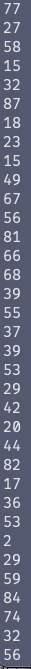

## 상황

현업에서 서버를 Spring -> Go로 리팩토링을 진행 했었다\
여기서 생겼던 이슈들 중 기억에 남는 이슈여서 적어본다

### 로직

서버 로직중 라우팅을 해야하는 로직이 존재 하는데(어떤 광고 서버로 라우팅을 할지 결정), 이 로직을 간단히 말하자면\
A: 50 B: 40 C:10으로 값이 들어온다면(DB에 존재 - 해당하는 기준에 맞추어 여러개가 존재) 라우팅을 통해 A에 50% 확률로 보내고, B는 40%, C는 10% 확률로 보내는 라우팅 기능을 하는 것이다

이 기능을 위해서 우리는 Random 함수 기능을 사용했다! ( Spring 원본 코드에도 존재하는 로직 )\
Random에서 0에서 99 사이의 값이 나오게 하고 +1을 하여 1~100의 랜덤 숫자를 뽑은 후, A의 50부터 빼면서 계산하는 것이다 ( 랜덤 값이 A보다 크면 빼고, 아니면 A당첨, 그 다음은 뺀 값으로 B, C,,.... 진행 )

사실 로직만 보면 큰 문제도 없고, 기본 자바에서도 정상적으로 돌아가는 로직이기에 그대로 작성하였고, 실제로도 정상작동 하고, 개발 및 qa에서도 문제가 없었기에 production에 올리게 되었다

... 하지만 몇일 뒤 이슈가 나왔는데...

### 문제

**\*"항상 같은 값으로만 라우팅이 되요"\***\
? 이 이슈를 들었을 때, 당연히 저 A,B,C 같이 라우팅 기준을 정해주는 DB값이 잘못되었겠구나 로그 및 signoz를 이용해 확인을 해봐도 아무런 문제가 보이지 않았다\
??? 당연히 같은 값으로 로컬 및 dev, qa에서도 문제가 없었다 오히려 제대로 라우팅이 되는 정상 동작을 하기에 production에서만 발생하는 이슈가 되어버린 것이다\
🤔 이렇게 되니 더 이해를 할 수가 없는 것인데... 진짜 진짜 원인을 알 수 없어 서버를 껐다 켰다... 그러니...

### 해결?


껐다 키니 되네?

갑자기 정상 작동하는 것을 확인하였다...\
결국 원인은 알 수 없지만 아마 메모리가 충돌난것이 아닐까라는 추측만 진행을 하고, 지켜보기로 결정 했다\
그렇게 하루가 지나고...

### 문제 다시 발생

결국 문제가 다시 발생하였다\
하지만 이번엔 전과 다르게 signoz상에 볼 수 있게 속성 값을 남겨두었기에 전보다 나은 상황이었다\
그렇게 드디어 원인을 알게 되었다...

## 원인

??? Random()에서 나온 결과값이 항상 0으로 나오는 이슈가 생긴 것이다...

이게 말이되는 것인가? 여러 언어 및 JAVA에서의 코드도 Random함수를 사용하였고, 당연히 문제따윈 없었다

그럼 뭐가 문제의 원인이란 말인가...

나 말고 다른 사람들은 이런 이슈가 없었던 것일까? 한번 찾아보자

### 자료조사

<https://github.com/golang/go/issues/3611>

[math/rand: document that math.Rand is not safe for concurrent use · Issue #3611 · golang/go

by gar3ts: I have a project that as an aside calls rand.Intn() many times with different values. My project frequently causes rng.Int63() to panic due to an out of range index: math/rand.(\*rngSourc...

github.com](<https://github.com/golang/go/issues/3611>)

음??\
Random() 함수가 thread unsafe할 수가 있나?\
혹시 이것이 원인인가 싶은 생각이 들었다\
하지만 Go의 Random은 왜 Thrad Unsafe한가 분석을 해보자

### 분석

```go
return 1 + int(float64(upper)*(float64(randomSeed.Intn(32767)+1)/(float64(32767)+1.0)))
```

위 로직에서 의심가는 부분은 randomSeed.Intn 하나이니 이 로직이 무엇을 의미하는지 봐보자

```go
func (r *Rand) Intn(n int) int {
    if n <= 0 {
        panic("invalid argument to Intn")
    }
    if n <= 1<<31-1 {
        return int(r.Int31n(int32(n)))
    }
    return int(r.Int63n(int64(n)))
}
```

흐음 아직은 문제가없다

```go
func (r *Rand) Int63n(n int64) int64 {
    if n <= 0 {
        panic("invalid argument to Int63n")
    }
    if n&(n-1) == 0 { // n is power of two, can mask
        return r.Int63() & (n - 1)
    }
    max := int64((1 << 63) - 1 - (1<<63)%uint64(n))
    v := r.Int63()
    for v > max {
        v = r.Int63()
    }
    return v % n
}
```

이 함수도 문제가 없다

```go
// A Source is not safe for concurrent use by multiple goroutines.
type Source interface {
    Int63() int64
    Seed(seed int64)
}

// A Source64 is a [Source] that can also generate
// uniformly-distributed pseudo-random uint64 values in
// the range [0, 1<<64) directly.
// If a [Rand] r's underlying [Source] s implements Source64,
// then r.Uint64 returns the result of one call to s.Uint64
// instead of making two calls to s.Int63.
type Source64 interface {
    Source
    Uint64() uint64
}
```

하지만 이제 여기부터 보면 문제가 보인다\
Source의 Int63을 보면 thread unsafe하다는 자백(?)을 적은 것을 확인 가능하다\
그럼 왜 thread unsafe인지 한번 더 봐보자\
거의 다 왔다

```go
// Int63 returns a non-negative pseudo-random 63-bit integer as an int64.
func (rng *rngSource) Int63() int64 {
    return int64(rng.Uint64() & rngMask)
}

// Uint64 returns a non-negative pseudo-random 64-bit integer as a uint64.
func (rng *rngSource) Uint64() uint64 {
    rng.tap--
    if rng.tap < 0 {
        rng.tap += rngLen
    }

    rng.feed--
    if rng.feed < 0 {
        rng.feed += rngLen
    }

    x := rng.vec[rng.feed] + rng.vec[rng.tap]
    rng.vec[rng.feed] = x
    return uint64(x)
}
```

자 보자...\
Uint64() 메서드를 보니. rng값이 생각보다 위험할 수 있다라는 것을 알게 되었다

최종적으로 rng.vec[rng.feed] = x 이렇게 rng.vec 테이블에 값을 갱신하는데, 여러 스레드가 동시에 여기에 접근을 하게 된다면 아직 읽고 있을때 값이 갱신될 수 있기 때문에 thread unsafe하다는 것이 된다

그래서 값이 꼬여서 동일한 값만 나오게 된것이라는 추측을 하게 되었다

## 테스트

진짜 그런지 한번 테스트를 진행해보자

가정은 수많은 스레드가 동시에 저 로직을 들어갈 때 오류가 생기는지 확인하는 것이다

```go
func main() {
    const maxWorkers = 99999 // 동시에 실행할 고루틴 수 제한 - 컴퓨터 성능 것 설정할 것
    const totalTasks = 99999000000

    var wg sync.WaitGroup
    taskChan := make(chan int, maxWorkers)

    // Worker 고루틴 생성
    for i := 0; i < maxWorkers; i++ {
        go func() {
            for range taskChan {
                fmt.Println(GetRandomNumber(100))
                wg.Done()
            }
        }()
    }

    // 작업 추가
    for i := 0; i < totalTasks; i++ {
        wg.Add(1)
        taskChan <- i
    }

    close(taskChan) // 작업 채널 닫기
    wg.Wait()       // 모든 작업 완료 대기
}
```

결과가 어떻게 될까?



음 솔직히 문제가 없다\
하지만 시간이 더 지나니...


위와 같이 모두 1이 뜨는 기현상을 보게 되는 것이다\
추측과 테스트가 맞으니 이제 해결해보자

## 해결

해결방법은 여러가지가 있겠지만 크게 2가지로 보자

1. 락
2. 다른 random 이용하기

이게 조금 애매했다\
다른 library를 사용하면 엄연히 이것들도 락을 사용하는 것이고... 락을 사용하면 순간적으로 많이 몰릴때 성능적으로 이슈가 발생할 것 같은 생각이 들게 되었다

그래서 고민하던 중, sync.Pool이 생각이 났다\
Thread Safe하게 할 수 있으며, 기존 로직을 크게 수정 안하며, 무엇보다 속도에 큰 영향을 끼치지 않기에 만족스럽게 사용 가능하다라는 판단을 하게 되었다

그래도 코드 수정을 하여

```go
package main

import (
    "fmt"
    "math/rand"
    "sync"
    "test/pool"
    "time"
)

const randomBufferPool = "randomBufferPool"

func init() {
    pool.Register(randomBufferPool, func() interface{} {  // 여긴 sync.Pool을 쓰면 된다
        return rand.New(rand.NewSource(time.Now().UnixNano()))
    })
}

// var randomSeed = rand.New(rand.NewSource(time.Now().UnixNano()))

func GetRandomNumber(upper int) int {
 randomSeed := pool.Get(randomBufferPool).(*rand.Rand)
 defer pool.Put(randomBufferPool, randomSeed)
    return 1 + int(float64(upper)*(float64(randomSeed.Intn(32767)+1)/(float64(32767)+1.0)))
}

func main() {
    const maxWorkers = 99999 // 동시에 실행할 고루틴 수 제한 - 컴퓨터 성능 것 설정할 것
    const totalTasks = 99999000000

    var wg sync.WaitGroup
    taskChan := make(chan int, maxWorkers)

    // Worker 고루틴 생성
    for i := 0; i < maxWorkers; i++ {
        go func() {
            for range taskChan {
                fmt.Println(GetRandomNumber(100))
                wg.Done()
            }
        }()
    }

    // 작업 추가
    for i := 0; i < totalTasks; i++ {
        wg.Add(1)
        taskChan <- i
    }

    close(taskChan) // 작업 채널 닫기
    wg.Wait()       // 모든 작업 완료 대기
}
```

위와 같이 돌리게 된 결과 정상 작동을 하는 것을 알게 되었다

## 후기

설마 랜덤함수가 문제를 일으킬 것이라고는 생각조차 하지 못하였다\
앞으로 무언가를 사용할때에는 side effect가 있는 건지 여러번 확인을 해야할 것 같다
