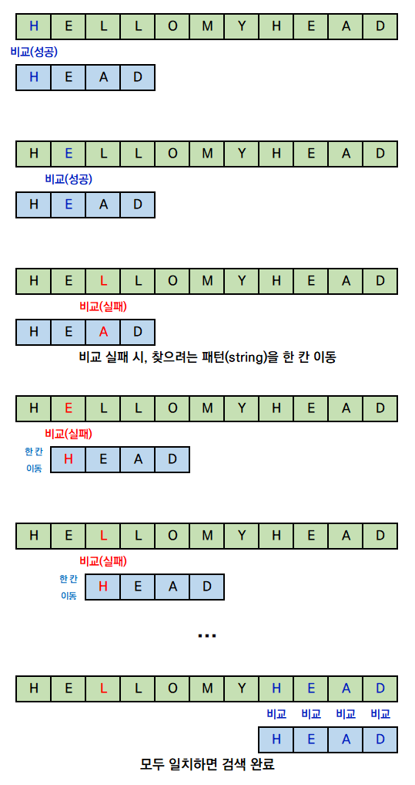
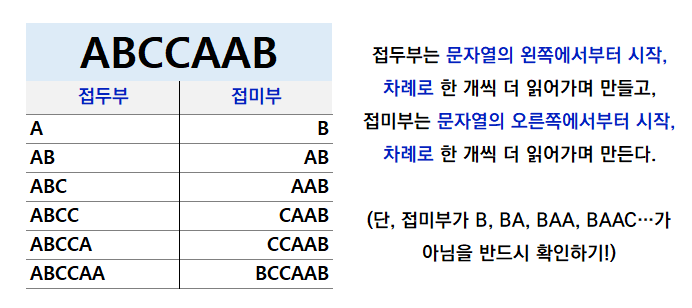
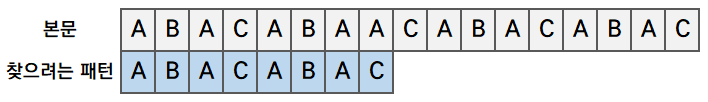
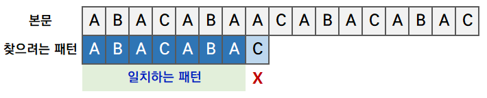
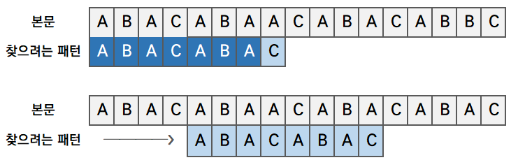

## 문자열 패턴 매칭

[이 사이트에서 많이 공부를 했다.](https://chanhuiseok.github.io/posts/algo-14/)

Python을 사용하다보면 문자열 처리에서 in을 단 한번이라도 써 본 사람이 많을 것이다.

물론 문자열 말고도 사용이 되지만 in의 역할은 문자열 내에 내가 찾고 싶은 패턴이 있는 문자열이 있는지 없는지에 대한 여부를 확인 가능하다고 한다.

**그럼 다른 언어에서는?**

이 궁금증을 해결하고자 찾아보니 KMP라는 좋은 알고리즘을 알게 되었다. (in도 이렇게 구현되지 않았을까...)

간단하게 KMP는 in 처럼 문자열 내에, 내가 찾고 싶은 문자열이 있느냐 없느냐를 판단하는 알고리즘이라 생각하면 된다.

시간 복잡도는 무려 O(n+m) // n은 비교 대상 문자열 길이, m은 찾고 싶은 문자열의 길이...

그럼 이 KMP가 과연 빠른가를 브루트 포스랑 비교해보자

### 브루트 포스로 해결해보기

위 사이트에서 HELLOMYHEAD라는 문자열에서 HEAD를 찾는 예시의 사진을 보여 주었다.



*https://chanhuiseok.github.io/posts/algo-14/*

일단 브루트 포스 답게 하나씩 이동하면서 다 비교를 해볼 수 밖에 없는 것이다.

그렇기에 n번을 움직여야 하며 비교대상 애들 또한 m개의 문자열을 다 비교할 수 밖에 없다.

그렇기에 O(nm)이라 말할 수 있다.

당연하게도 n과 m이 커질 수록 점점 시간 또한 오래 걸릴 것이다. (만약 m이 n이랑 같다면? n^2...)

그럼 이제 여기서 줄여나가야 한다.

제일 좋은 방법은 위에서 봤다 싶이 HEAD를 찾고 싶은데 HELL이 나왔다? 그럼 HE까지는 맞았으나 뒤에 LL때문에 다른것이라 생각할 수 있다.

반대로 말하자면 이 HE는 굳이 또 검색할 필요가 있는가? 즉 H다음에 E로 가는게 아닌 H에서 틀렸으니 바로 L로 가면 되지 않느냐 이 말이다.

### KMP

즉 위에서 나온 것 처럼 **불일치가 발생하기 전까지 같았던 부분은 또 비교하지 말고 넘어가자**이게 핵심인 것이다.

다만 이제 이해를 위해서 **접두부, 접미부, 경계**에 대해서 알아야 한다.

#### 접두부, 접미부, 경계

이들의 개념은 쉽다.

접두부는 문자열의 앞에서 부터 읽어 나가는 것이고, 접미부는 뒤에서부터 시작해 나가는 것이다.

다만 접미부랑 접두부는 최종적으로 전체 문자열이 될 수는 없다. 즉 접두부는 맨 마지막 단어 하나가 빠질 것이고, 접미부는 맨 앞 단어가 빠질 것이다.



*https://chanhuiseok.github.io/posts/algo-14/*

위 그림에서도 나오다 싶이 접미부는 조심해야 할게 BA가 아닌 AB로 문자열내에서 그 순서는 지켜주어야 한다.

그리고 경계는 **접두부와 접미부가 같을 때 경계**라고 한다.

예를 들어 위 표에서 AB는 접두부와 접미부가 서로 같다.

따라서 우리는 이 AB가 경계라고 할 수 있다.

만약 이 경계가 여러개가 나온다면?

**그러면 보통은 최대 길이의 경계로 판단한다.**

#### 알고리즘 순서

이제 본격적인 알고리즘 내용이다.

1. 일단 당연하게도 첫 문자부터 비교를 해야 한다.



*https://chanhuiseok.github.io/posts/algo-14/*

이렇게 두고 이제 비교를 해보는 것이다.

2. 만약 다 일치하지 않는다, 이러면 불일치 하기 직전까지 일치하는 패턴에서 최대길이 경계를 뽑아낸다.



*https://chanhuiseok.github.io/posts/algo-14/*

위 예시에서는 C에서 불일치를 하니 ABACABA문자열에서 경계를 찾으면 된다

그러면 우린 A와 ABA가 경계로 나오지만 최대 길이 조건으로 인해 ABA가 경계가 된다.

3. 그럼 선택한 경계에서(ABA) 접두부, 접미부를 파악한 후, 찾으려는 패턴을 접미부의 시작 문자열까지 이동한다.



*https://chanhuiseok.github.io/posts/algo-14/*

자 이렇게 ABA의 접미부 시작 위치로 이동한 것이다. 이렇게 할 경우 우리는 앞의 3글자를 건너 뛰고 찾을 수 있을 것이다.

이렇게 한 후 1번부터 돌아가 계속 반복한다... 문자열을 다 돌 때 까지

4. 만약에 경계가 없거나, 모두 불일치 하는 경우는?

예를 들어 찾는 단어가 AB이런 다면 경계가 존재할 수 있겠는가...

또한 HELLO라는 문자열에서 ABC를 찾을려고 해보자. 모두 불일치가 뜰 것이다.

이런 경우는 어떻게 할까...?

답은 처음으로 불일치 하는 부분까지 패턴을 이동시킨다. 이것이 끝이다. ( 다만 모두 불일치이면 그냥 한칸 이동이면 끝이다. )

그리고 1번과정으로 돌아간다.

#### Failure Function, PI

다만 이렇게 접두부, 접미부를 만들고, 분석하는 것을 매번 움직일 때마다 한다면 이게 브루트 포스랑 비교해 과연 큰 효율적인지가 애매하다 생각이 된다.

그래서 이동시 참고 할만한 테이블을 만드는 것이다.

그때 사용하는 함수를 Failure Function이라 하는데, 사실 이 말은 잘 안쓰고, 그냥 테이블을 만든다 생각하자.

여기서 자주 나오는 단어가 pi였다.

별거는 없고, 그냥 접두부 == 접미부 즉 경계의 최대 길이를 구해 값을 넣자 이거다. 약간 값을 미리 **전처리**한다 생각하자,

즉 예시로 비교하고자 하는 패턴이 abacabaac라고 가정해보자

| 인덱스 | 문자열 | pi[i] 최대 경계 길이 |
| --- | --- | --- |
| 0 | a | 0 |
| 1 | ab | 0 |
| 2 | aba | 1 |
| 3 | abac | 0 |
| 4 | **a**bac**a** | 1 |
| 5 | **ab**ac**ab** | 2 |
| 6 | **aba**c**aba** | 3 |
| 7 | **a**bacaba**a** | 1 |
| 8 | abacabbaac | 0 |

이렇게 구해질 것이다.

그렇기에 만약에 i번째에서 문제가 터졌다... 그러면 pi[i-1] 위치로 비교를 계속해서 가면 된다. ( i-1인 이유 인덱스가 0부터 시작하니... 1부터 시작하면 pi[i]로 계산이 될 것이다! )

## 코드

### Failure Function(pi)

```python
def table(pattern):
	lp = len(pattern)
	tb = [0 for _ in range(lp)]
	pidx = 0
	for i in range(1,lp):
		while pidx > 0 and pattern[i] != pattern[pidx]:
			pidx = tb[pidx-1]
		if pattern[i] == pattern[pidx]:
			pidx += 1
			tb[i] = pidx
	return tb
```

일단 0번째 인덱스는 무조건 값이 0일 것이다.

또한 만약에 불일치 하다면 불일치가 풀릴 때 까지 pidx를 tb[pidx-1]로 갱신을 해주어야 한다.

왜그래야 하는가?

현재 인덱스와 pidx가 서로 다르니 pidx를 감소시켜서 다시 비교해 보겠다란 의미이다.

### KMP

```python
def kmp(word, pattern):
	tb = table(pattern)
	results = [] # 패턴이 일치하는 게 있으면 인덱스 저장
	pidx = 0
	for idx in range(len(word)):
		while pidx > 0 and word[idx] != pattern[pidx]:
			pidx = tb[pidx-1]
		if word[idx] == pattern[pidx]:
			if pidx == len(pattern) - 1:
				results.append(idx - len(pattern) + 2)
				pidx = tb[pidx]
			else:
				pidx += 1
	return results
```

간단하다.

처음에 일단 우리는 저 테이블이 필요하니 테이블을 받아온다.

그 다음 똑같이 이론처럼 돌리는데, pidx의 역할은 위 테이블이랑 똑같다 생각하면된다. ( 패턴 맞출 문자열의 index )

만약 문자열의 값과 pattern의 pidx 인덱스의 값이 다르다면 pidx는 tb에 맞춰 이동을 해야 한다.

만약 word랑 pattern의 서로의 인덱스 위치의 값들이 같다면 pidx를 1씩 증가 시켜준다. 그러다가 만약에 pidx가 끝까지 갔다라고 한다면 그 위치값을 기록해주는 것이다. 그리고 나서 위치 값을 기록했으니 pidx는 tb[pidx]로 초기화를 해준다. (다음으로 계속 이어가야 하니)

그런데 여기서 의문이 하나 생길 것이다.

아니 왜 idx - len(pattern) + 2이지?

왜냐하면 여기서는 그 인덱스의 시작위치 값을 기록해야하기 때문이다.

## 참고 자료

<https://chanhuiseok.github.io/posts/algo-14/>

알고리즘 - KMP 알고리즘 : 문자열 검색을 위한 알고리즘

＠ 문자열을 검색하려면? : 패턴 매칭

chanhuiseok.github.io
