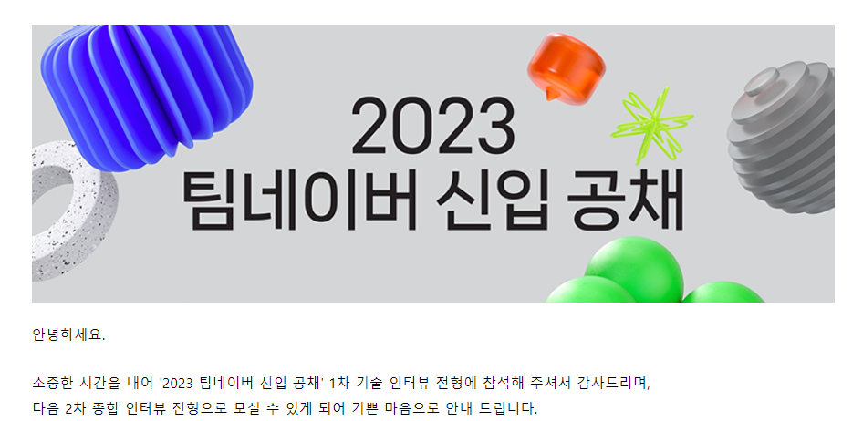
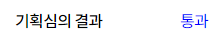

면접을 5월 22일에 보고, 계속해서 복기를 하니 내가 정말 대답을 못했구나...

정말 아는 거를 다 보여주지도 못했고, 많은 부분을 틀렸구나라는 사실을 계속해서 상기하게 되었다...

이러니 솔직히 떨어져도 어쩔수 없었다라는 생각이 들었다. 그래도 다음에는 네이버에서 얻은 지식을 가지고 더 잘 나아가야겠다라는 생각만 하는 상태로 하루하루 살아가고 있었다.

그러는 도중 5월 24일 소마에서 1차 기획 심사에 2번째 파트로 우리 팀이 발표하게 되었다. 이 기획 심사를 통과하지 못한다면 6월 22일에 다시 보강해서 발표를 해야 하므로 너무 텀이 길어지고, 개발이 늦어진다는 큰 단점이 있었기에 한번에 통과하기를 바라면서 발표를 했으나...

> 개망

아... 피드백이 이 기술의 도전 난이도가 많이 낮은 듯 하다. 이거를 더 올려라! 이걸 많은 사람들이 사용하겠느냐? 너무 부수적인 기능들이 의미없이 들어간거 같다 등 혹평을 듣게 되었다.

아 두번 연속 이러니 조금 흔들리긴 했었는데... 뭐 **면바면**이라는 희망회로를 돌리면서 진행해 가고 있었다...

## 그리고 6월 2일 결과...가 나왔다..

소마 발대식이 6월 2일... 이 때 난 발대식에 참석한 상황이었다.

사실 네이버가 언제 결과가 나온다 이런 말은 없었으나, 뭔가 느낌상 오늘일꺼 같다라는 삘이 들었다.

그리고 소마 기획 심사 결과는 뭐 오늘까지라 했으니...

그렇게 발대식 도 중 한 16:30분 쯤에 카톡을 잠깐 보니 난리가 나있는 것을 보고 마음의 준비를 하게 되었다.

그렇게 메일에 들어가 확인을 하니...

## ?????? 붙었네..???

처음으로 대기업 1차 면접 전형을 통과했다 ㅠㅠ

내가 붙었어? 라는 생각에 당황함과 기쁨이 동시에 들었다.

사실 기쁠 수 밖에 없었다. 네이버라는 큰 회사에 2차 면접 까지 가게 될 줄은 ㅎㅎ

이렇게 되면 희망 회로가 돌아가는데... 방심하지 말고 열심히 준비해야겠다.

그렇게 희망적으로 집에 가는 도중 소마에서도 결과가 나왔다는 메시지를 받게 되었다.

떨리는 마음으로 들어간 결과

아... 운이 참 좋은 날인 듯 하다.

사실 아침에 빵을 잘 못 먹고 배탈이 나 하루종일 배앓이를 했는데, 그래서 참 운도 없다 라고 생각했는데, 뒤에 있을 것을 위해 아팠나 보다 ㅎㅎ..(아니면 말고)

열심히 살아야겠다 앞으로도
