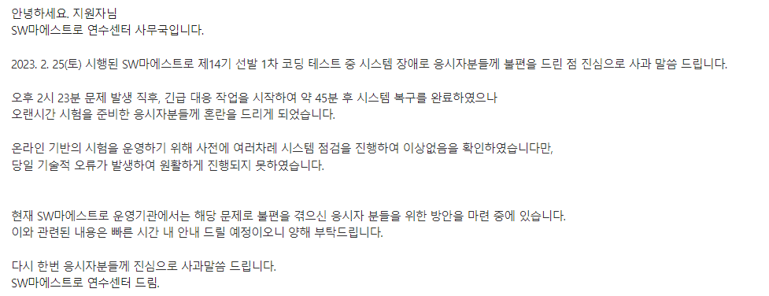

## 배경

처음으로 소마를 지원하게 되었다. 나이가 조금 있고, 대학을 졸업을 했어서 아 이걸 내가 지금 지원해도 옳은가 라는 생각이 계속 들었다.

그렇게 고민을 하다보니 어느새 2/25일... 일단 코테 1차를 보기로 결정하였다.

문제는 알고리즘 4개! SQL 1개로 저번 기수랑은 Web이 없어지고 문제수도 줄었다.

2시에 시작을 하였으나 중간 중간 멈추는 느낌이 들기는 하였는데....

일단 미리 말하자면 난 2솔을 하였다.

사실 문제는 4개를 풀었으나 예외처리라던가 히든 케이스를 제대로 고려하지 못하여 2문제는 확실하게 틀린것으로 판단되었다.

#### 문제를 간단히 요약하자면

1번 아마 단순 구현인것같다

2번 또한 단순 구현이다

3번 알고보니 완탐 + 조합의 문제였다

4번 bfs로 풀리는 문제이다.

이렇게가 알고리즘 요약이었다.

아 근데 이전 기수 후기들이랑 비교해서 개인적이지만 체감상 1차코테의 난이도가 많이 올랐다 생각한다.

적어도 실버 5? 실버 못해도 1의 문제 이상에서 골드 급의 문제였다 판단된다.

만약... 내가 sql에서 삽질만 안했어도 2번을 풀었을텐데... 그럼 3솔인게 너무 아쉽다.

다음에는 확실한 선택과 집중을 해야겠다.

#### SQL같은 경우는

요약하자면 아니 프로그래머스 SQL kit만 풀라면서요?

전혀 없는 문제가 나왔다.

다음 기수부터는 절대로 믿지 말고 저것도 풀고 여러 함수에 대해 알아두자

개인적으론 이번엔 정규표현식, 문자열 이으기, 자르기 등 여러 함수들을 이용하거나 알아두면 좋을 것 같다.

### 문제 발생

아 알고보니 튕기는 사람들도 생기고, 서버가 잘 작동하지 않는 경우가 발생해 문제 이슈가 커졌다.

그래서 45분의 추가시간을 모든 사람에게 준 것으로 보인다.

솔직히 정부에서 주관해주는 곳에서 이런 문제가 발생하는 것은 조금 미숙해 보이기는 하였으나, 어쩔수가 있나... 일단 문제를 풀기로 결정하였다.

### 사과문

뭐 일단 이미 지나간 일이기도 하고... 코딩테스트에서 장애가 발생하는 케이스가 여기만 있는 것도 아닌지라 이해는 하였다.

항상 어떤 일이 일어날지 모르는 것이 IT아닌가 하하...

결과가 어떻게 나올지는 모르겠지만 노력은 해보겠다!
