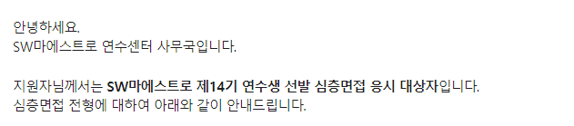
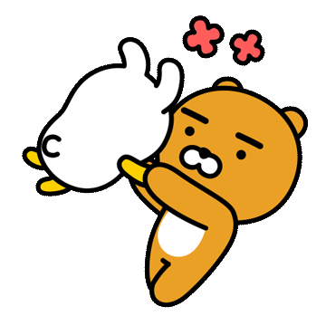
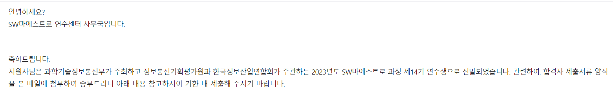

## 코테 2차

코테 1차에 문제가 많이 터져서 그런지는 몰라도 대부분의 사람들이 2차까지는 볼 수 있었던 것 같다.

솔직히 확실히는 아니지만 1솔인 분들도 붙었다는 것을 봐서는 더욱 그런것 같은 생각이 들었다.

그렇게 해서 시작된 코테 2차...

### 문제 간단 요약

1. 단순 구현

2. 그리디 + 시뮬레이션 (아마도...?)

3. 자료구조 + 구현

4. 그래프 ( 문제도 제대로 못 봤어요...)

5. sql => union or 서브 쿼리

### 후기

이렇게 5문제가 나왔다.

이번엔 조금 구현 관련 문제가 많이 나왔고 냉정하게 말해서 1번과 5번을 제외한 모든 문제가 난이도는 있었다고 생각한다.

후기를 들어보면

1 < 5 < 3 <<<< 2 <= 4 정도의 난이도 인 듯 하다.

실제로 2번이 어렵게 나와서 3번으로 바로 넘어가서 3번을 푸는 것이 합격의 지름길이였다...ㅜㅠ

**그러니 다음 기수를 준비하시는 분들이라면 문제를 전부 다 읽고 난이도를 선택해 푸는 것을 추천드린다.**

나는 여기서 1, 5, 2를 풀었으나 2번에서 몇몇 케이스를 놓친 것을 확인하여 2.5 솔? 이정도를 보고 있었다.

그렇게 떨어질 것을 각오하고 다른 것을 준비하던 도중...

---

## 면접

운이 좋게도 2차 코테를 합격하였다.

운이 많이 좋았다고 판단하는데, 아마 커트라인이 2.5솔에서 2솔 몇몇이 해당되지 않았나 싶다.

나는 3/17일 13:40분에 면접을 보기로 결정되어서, 면접을 대비하기 위한 CS 스터리를 만들어 CS를 준비하고 면접장에 들어갔다.

### 복장

복장에 대해 많은 고민을 하신 분들이 많았는데, 저 같은 경우 그냥 편한 옷을 입고 갔습니다. 평범하게 바지는 츄리닝이나 청바지는 아닌 깔끔해 보이는 바지에, 위는 겉옷을 입고 있었지만 맨투맨으로 ㅎㅎ...

이 정도만 하고 갔습니다.

### 자기소개서 + 포폴

notion에다가 자기소개 + 포폴을 준비하라 하는데, 엄청 화려하게 안 만드셔도 됩니다.

화려하게 만들어봤자 발표시간이 짧아 다 말하지도 못하니 진짜 중요한 것만 골라 말하는 것을 추천드립니다.

저는 포폴을 한 개만 적었습니다. (한개 밖에 없어서 ㅠ)

대신 그 한 개를 적을 때, 내가 맡은 역할 + 이 역할에서 문제가 터질시 어떻게 해결했는가 이런 것들을 자세하게 적어 제출하였습니다.

그리고 면접 질문이 싹 다 그 **이 역할에서 문제가 터질시 어떻게 해결했는가 여기에서 나온것을 보면 참고하셔도 좋을 것 같습니다.**

### 들어가보니?

일단 면접 대기장으로 가면 면접비로 **3만원을** 지급합니다. (꽁돈 아싸)

그렇게 대기를 타고, notion기준 자기소개를 한 후, 사람들끼리 질문을 받습니다.

진짜 면 by 면으로 면접관마다 방마다 질문과 관심사가 다른 것을 쉽게 알 수 있었습니다.

저희의 경우 전체 질문은 한 문제도 없었고, 프로젝트 관련 질문들이 많이 나왔습니다.

저의 경우는 캐시 관련 질문만 3문제.... 모르는 것이 나오면 어떻게 찾아보느냐 이런 질문들을 하셨습니다.

기술 면접은 사실상 없었고, 얼마나 자신의 포폴을 잘 아는가. 왜 이 문제가 있을시 그렇게 했는가. 이런 것들을 위주로 물어보셨습니다.

그러니 다음 기수분들은 자신의 포폴 + 자기가 왜 그렇게 했는지 꼭 알아가두세요.

## 결말

합격!

취준을 하면서 할 것이 생겼네요!

더 좋은 미래를 위하여... 힘을 내겠습니다!
