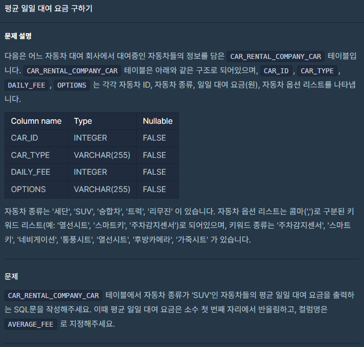

정말 오랜간만에 SQL을 다시 보게 되었다.\
까먹은 것이 너무 많아 낮은 단계부터 천천히 공부해 볼까 한다.

## 문제



#### 공부..또 공부

아주 간단한 SQL문이다.

Select From Where이라는 기본적인 틀에 평균과 avg를 넣는 것이다.

그럼 한번 넣어보자.

#### 정답 코드

```sql
SELECT ROUND(AVG(DAILY_FEE),0) AS "AVERAGE_FEE"
FROM CAR_RENTAL_COMPANY_CAR
WHERE CAR_TYPE="SUV"
```
