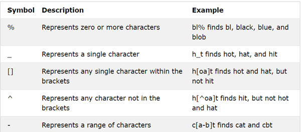

Like 같이 문자열 패턴 검색시 사용되는 문자들이다.

대표적으로 이 5개가 있다고 생각하자.

- % : 0 or 그 이상의 문자가 들어올 수 있다 가정
- \_ : 하나의 문자만 들어올 수 있다.
- [] : 이 안의 문자들 중 하나만 허용
- [^] : 위와 반대로 여기 안에 들어간 그 어떠한 문자도 허용 x
- - : 범위 지정(ex)a-b => a,b)
