스레드에 관한 이야기를 하기 전에 병렬 프로그램에 대해 생각을 해보자.

과거에는 나도 병렬 프로그래밍과 스레드로 프로그래밍 하는 것의 차이를 생각 못했었다.

이제 다른 것을 알게 되었으니 한번 정리하고자 하낟.

**요약해서 간단하게 정리하면 병렬 프로그래밍이란 하나의 프로그램을 하나의 프로세스가 맡는 것이 아닌 n개의 멀티 프로세스를 이용하여 개발을 하는 것이다.**

스레드는 최근 스레드 별로 프로세스를 할당하는 것으로 보이나 엄연히 하나의 프로세스에서 n개의 스레드를 실행하는 것과는 다른 이야기다.

멀티 스레드 같은 경우는 I/O같은 작업에서 압도적인 성능을 향상시켜주는데, 병렬처리는 CPU 관련 처리에서 성능을 향상 시켜 준다.

### Flynn’s Taxonomy on Parallel COmputer

- SISD
  - 하나의 명령어 스트림, 하나의 데이터 스트림
- SIMD
  - 하나의 명령어 스트림, 여러개의 데이터 스트림
- MISD
  - 여러개의 명령어 스트림, 하나의 데이터 스트림
- MIMD
  - 여러개의 명령어 스트림, 여러개의 데이터 스트림

#### SISD

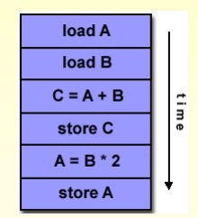

그냥 간단하게 non-parallel 컴퓨터인 것이다. 가장 오래되었고, 가장 흔한 타입이라 볼 수 있다.

#### SIMD

모든 프로세싱 unit들은 같은 명령어를 실행한다. 다만 다른 data로

대표적인 예시가 그래픽 처리이다.(GPU)

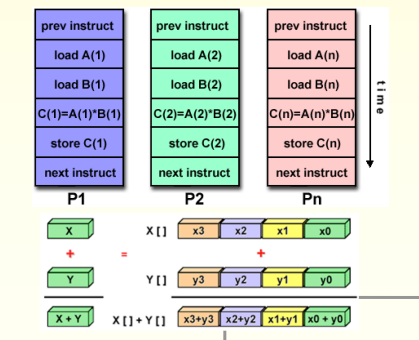

#### MISD

각 프로세싱 unit이 하나의 데이터를 가지고 여러 명령을 수행한다.

(사실상 거의 쓰이지 않는다고 생각해도 된다.)

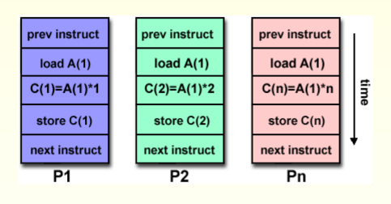

#### MIMD

현대에 많이 쓰이는 병렬 컴퓨터라 생각하자.

각 프로세서들이 다른 명령어 스트림을 실행하고, 각 프로세서들이 다른 데이터 스트림을 실행한다.

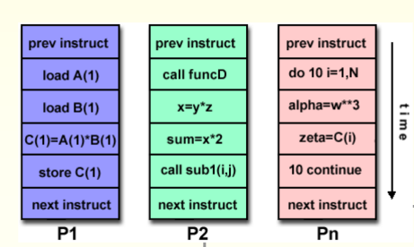

## Parallel Program 만드는 방법

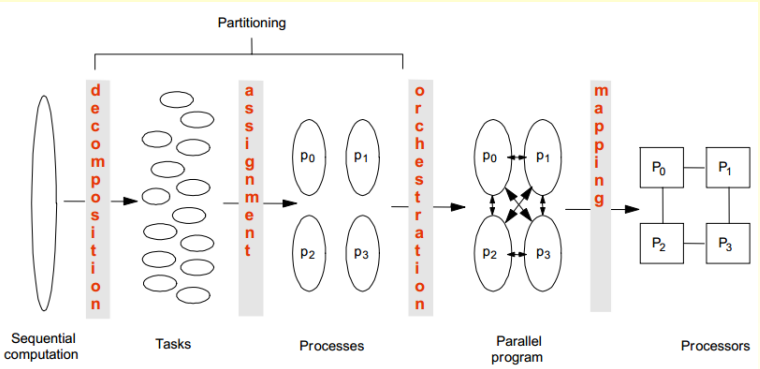

1. Decomposition ⇒ 분해
2. Assignment ⇒ processor에 할당
3. Orchestraion/Mapping ⇒ communication & 동기화

#### Decomposition

그냥 간단하다 프로세스에 나눠주기 위해 작업을 쪼갠다고(tasks) 생각하면 된다.

간단하게 일반적으로 우리는

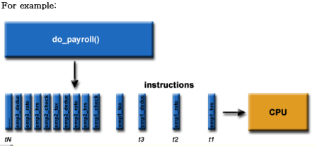

밑 그림처럼 작업을 진행했는데, 이것을

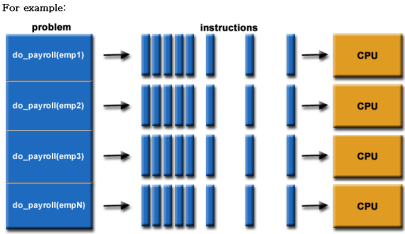

이렇게 일을 나눈다고 생각하면 된다.

이렇게 나누는 대에는 Domain Decomposition 과 Functional Decomposition이 있다.

#### Domain Decomposition

분해에 데이터를 기반으로 한다.

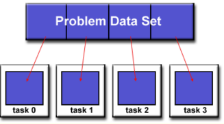

이렇게 분해를 할때 말그대로 문제의 데이터 셋을 기반으로 쪼갠다.

이 쪼개는 방법에는 크게 block, cyclic, dynamic이 있다. 이것에 대해서는 후에 자세하게 설명하겠다.

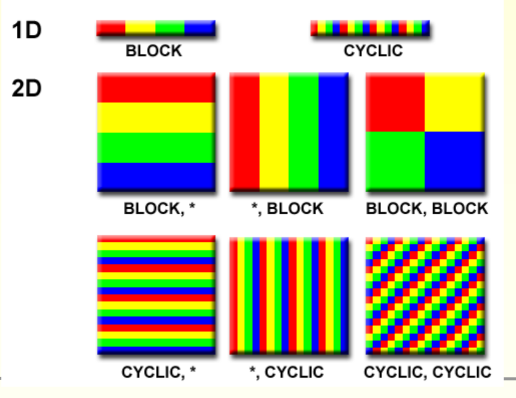

#### Functoinal Decomposition

반대로 computation에 더 집중을 한 것이다.

즉 문제가 무조건 해야하는 일을 기준으로 분해가 된다.

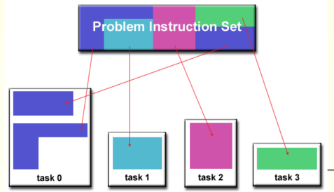

#### Assignment

스레드에게 tasks를 할당을 해주는 작업을 한다.

- 여기서 중요한게 Balance있게 workload를 해야하고, communication을 줄이고 cost를 관리해야한다.
- 만약 decomposition과 같이한다면 우린 이것을 **Parititioning**이라한다

이 작업은 **static** 또는 **dynamic**하게 작동 될 수 있다

그러나 balanced한 workload를 잡을려고 하면 communication costs가 잡히지 않을 수가 있다. 즉 이 둘은 trade off 관계인 것을 명심하자.

#### Orchestration

가장 중요한 역할은 communication과 synchromizaion(커뮤니케이션과 동기화)이다.

목표는

- Communication과 동기화의 cost를 줄이자.
- Reserve Locality of data reference

#### Mapping

스레드를 실행 units( CPU cores)에 매핑한다.

이 일은 OS가 담당한다. (일반적으로 프로그래머가 할 것은… X)

매핑에서는 관련된 스레드들을 같은 프로세서(cpu)에 배치하고

locality를 극대화하고, data sharing, comm/sync의 비용을 줄인다.

> Locality란\
> CPU가 기억장치에서 데이터를 가져올려고 할 때, 최대한 병목 현상 없이 빠르게 데이터를 찾게 하는 것이 목표이다.\
> 레지스터, 캐시, 메인 메인메모리, 하드 디스크 순으로 속도가 느린데, 그래서 가능하면 빠르게 접근할 수 있게 하는 것이 목표인 것이다. (예를들어 캐싱 정책이랑 관련이 크다.)\
> 자세한 건 후에 정리하겠다.

자 그럼 위 3가지 작업이 각각 어떤 요소가 영향을 주는가 생각해보자.

- Decomposition : 병렬 프로그래밍 가능한 코드 영역 범위
  - Amdahl’s Law랑 관련이 있다.
  - 즉 프로그램이 병렬로 실행할 때 성능을 높일려면 Parallel part가 많아야 한다는 의미이다.
  - 또한 프로세서의 수가 많아지면 많아 질수록 더 성능이 좋다는 의미이다.
  - 하지만 무한정 프로세서가 많아진다고 스피드가 올라갈까?
  - 현실은 절대 아니다. 프로세서 수가 많아 진다고 성능이 y=x꼴로 늘어나지는 않는다.
  - 동기화나 로드 밸런싱, assignment…. 수가 많아지면 이것도 당연히 감당해야하고 이것들은 overhead가 되기 때문이다.
- Assignment : 프로세서 간 파티셔닝의 세분화
  - Granularity(알갱이) : level of work units(tasks)
  - 이게 중요한 것이 얼마나 큰 크기로 스레드에 할당할 것인가를 결정한다
  - Coarse : 큰 알갱이로
  - Fine : 작은 알갱이로 그럼 둘 중 어느 쪽이 좋은 것일까? ⇒ 답이 없다(장 단점을 보고 상황에 맞춰서 써야한다.) Fine-grain인 경우 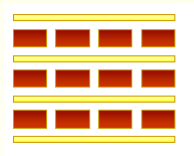
  - 통신 비율 대비 낮은 communication
  - communication에 큰 부하가 있다.(동기화도)
  - 그러나 로드 밸런싱에는 아주 뛰어나다 Coarse-grain인 경우 
  - 통신 대비 많은 양의 일을 처리 한다.
  - 그렇기 때문에 동기화나 communication에 부하는 적다
  - 그러나 로드 밸런싱 측면에선 좋지 않다. 두가지 모두 장단점이 있기에, 알고리즘, 하드웨어에 맞춰 짜면 된다. 대부분의 경우에 communciation과 동기화에 스피드에 부하를 주는 요소가 많기에 coarse grain이 그 부분에선 장점을 얻고 간다. 반대로 Fine은 로드 밸런싱이 안맞는 것을 어느정도 커버를 쳐준다
- Orchestration / Mapping : Locality

## 로드 밸런싱(Load balancing)

로드 밸런싱에 대한 설명을 해야 할 것 같다.

간단하다 그냥 모든 스레드던 프로세서던 다 바빴으면 하는 것이 목표이다.

프로세서는 엄청 큰 비용의 자산이기에 안바쁘면 우리가 손해다.

그래서 계속 계속 바쁘게 해주자.

### Static Load Balancing

간단하다 미리 programming time때(complie time) 정해주는 것이다.

그렇기에 각 코어마다 같은 양의 일을 받을 수 있다.

그러나 몇몇 코어는 다른 코어보다 더 빠를 수 있고, 일의 분배가 적절하지 않을 수 있다.(뒤에 소개)

### Dynamic Load Balancing

compile time이 아닌 run-time에서 정하는 것이다.

즉 만약에 어 너가 노네? 그럼 너가 이 일 맡아? 어 이번엔 너가 노네 너가 맡아!

이런 식으로 말이다.

그렇기에 runtime에 부하가 매우 높게 된다.

장점으로는 완벽하게 분배가 된다.

그럼 둘 중 어느 것이 더 좋을까?

로드 밸런싱 차원에선 다이나믹 한 것이 더 잘 분배했다고 볼 수 있다.

하지만 communication이나 동기화 입장에선? 과연 그렇다고 말하기가 쉬울까? 아니다. 그렇기에 이 둘고나계는 trade off 관계인 것이다

#### Static Load Balancing과 Dynamic Load Balancing 예시로 비교하기

예를 들어

1 ~ 1000000000 사이에서 소수를 구하는 프로그래밍을 한다고 해보자

static으로 10개로 나누어서 일을 시킨다고 할 때, 우리는 1~~1억, 1억 1~~2억 이런식으로 나눌 수 있다.

이렇게 static으로 실행할 때 분명 각 코어마다 1억개의 데이터만 처리하기에 같은 양의 일을 받았다고 할 수 있다.

하지만.

과연 이게 모든 코어가 동일한 시간내로 끝날까?

소수 판별 프로그램이 간단하게 2~루트까지의 값만을 나누어서 나눠 떨어지는게 있나 없나를 체크한다고 가정할 때,

당연히도 숫자가 크면 클 수록, 이 숫자가 소수 인지 아닌지 구별하는게 오래 걸릴 수 밖에 없다.

반대로 숫자가 작으면 작을 수록, 판별은 더 빨라 진다.

그래서 사실상 작은 값을 받은 코어가 더 빠르게 일을 끝내고, 놀게 되는 것이다.

반대로 dynamic같은 경우, 일이 끝나면 다음 일을 받기에 내가 처리한 소수가 바로 끝났다? 그럼 바로 다음 것을 받고 이런 식으로 가기에 쉬는 타임이 줄어들지만 동기화나 communication이 거기에 껴있다면? 그것에 부하를 받는 것이다.

## Communication이란

자주 써져있어서 햇갈릴 수 있을 것 같아 작성했다.

간단하다 그냥 message를 전달한다고 생각하자.

방법으로는

- Point to Point 점대점
- Broadcast(one to all) & Reduce(all to one)
- All to All
- Scatter(one to several) & Gather(several to one)

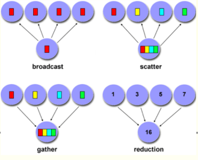

이 있다.

그럼 이 Communication은 부하가 심할까?

⇒ 매우 심하다.

보통 이것이 일어날때 동기화를 하는 경우가 많다. 그래서 기달리는 시간이 더 길어진다.

만약 shared memory computer라면? 굳이 필요하지 않을 것이다. (메모리를 공유하니)

그러나 분산 컴퓨터라면 이 과정이 필요할 것이다.

#### 동기화 vs 비동기화

- 동기화 : 데이터를 공유한 것을 처리하는 **handshaking작업이 필요하다**
- 비동기화 : 그냥 데이터를 서로서로에게 전달한다.(독립적으로)

#### Blocking vs Non-Blocking Messages

Blocking Message(유사한 것이 위의 동기화)

- Sender는 메시지가 전달될 때까지 기달려야 한다
- 수신자도 메시지를 수신할 때까지 기달려야 한다
- queue가 빌때까지 기달려야한다 생각하자
- 그래서 데드락의 가능성이 있다.

Non-Blocking Message(유사한 것이 위의 비동기화)

- 메시지가 전송이 안되었더라도 계속 작업한다
- 그래서 쉬는 시간이나 데드락을 방지한다
- 그러나 만약에 queue가 꽉 차면 에러가 난다.

### 동기화

Node.js에서 동기화에 대한 설명은 여기서랑은 많이 다르다.

왜냐 여긴 멀티 프로세싱, 스레드 기준이기 때문이다. (싱글 스레드인 Node 나가~)

간단하게 runtime에서 정확한 순서를 보장하고 예상치 못한 문제를 방지하는 것을 동시에 일어나는 일에 대해 조정한다고 생각하자.

동기화의 종류로는

- Barrier
  - 간단하게 모든 스레드나 프로세스들이 이 지점까지 와야 시작하는 것이다.
  - 미리 도착하면 그 만큼 wait
- Lock/semaphore
  - 유명한 기법이다.
  - lock을 걸면 멈추고 release를 하면 다시 일을 시작하는 것이다
  - 한 프로레스가 임계 영역에서 작업을 하면 다른 프로세스들이 진입 하지 못하게 막는 것이다.
  - 세마포어는 lock과 비슷하지만 차이점으로는 lock은 하드웨어 명령어를 활용하지만 세마포어는 시스템 api라고 생각하자.
  - mutex라는 개념을 알고 있으신 분들도 있을 것이다만 그건 다음에 정리해보겠다.(OS영역에서)
